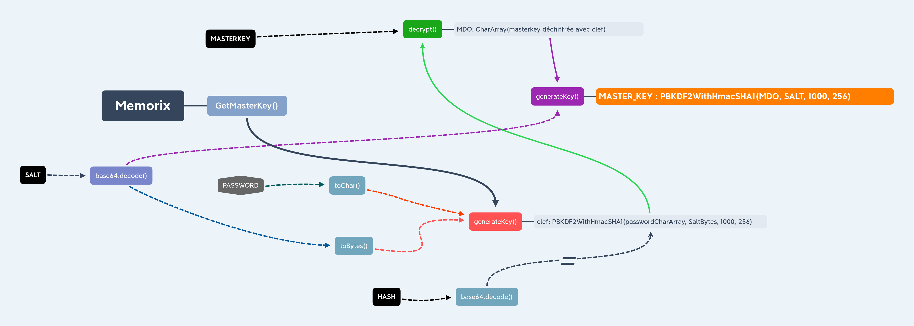

:icons: font
[%hardbreaks]
:source-highlighter: coderay
:coderay-css: class

= Oreo 1: Write UP

VulnHub CTF Walkthrought
2020/07/15

link:https://www.vulnhub.com/entry/oreo-1,435/[Oreo] is a VulnHub CTF based on an Android Device. +

.Learnings : 
* Reverse Engineering
* Advanced SSH functions

.Difficulty:
* User Flag: HARD
* Root Flag: Medium (User flag required)

NOTE: During this walkthrought, oreo.local equals oreo ip adress

== First Step : Enumeration
[%hardbreaks]

=== 1. Nmap
Firstly , we have to do a nmap scan for see availables ports.
We can use : `nmap oreo.local -p-` +
Nmap returns us:
[source]
----
PORT      STATE    SERVICE
5555/tcp  filtered freeciv // <1>
8022/tcp  open     oa-system // <2>
8384/tcp  open     marathontp // <3>
22000/tcp open     snapenetio // <4>
----
<1> Used port by ADB 
<2> 8022 , 22 ? SSH ? 
<3> Unknown
<4> Unknown

=== 2.Check Unknown Services
==== 1. 8022
For checking this port , you just have to do `nc oreo.local 8022`
Netcat print us `SSH-2.0-OpenSSH_8.0` +
Ok. 8022 is  SSH

==== 2. 8384 and 22000
For checking these ports, a simple google search works , if you type "port 22000 8384", you're gonna find this link:https://docs.syncthing.net/users/firewall.html[link] +
This link is talking about Syncthing, a tool for sync and backup data between some devices. +
This service is using both ports , 8384 and 22000 , we found what it was.

==== 3. 5555
This port seems to be protected , that's interesting, it can mean that it is a sensitive port , and , after some researches , we know that adb is using this port for remote shell +
So, we can suppose that 5555 = adb

==== RECAP:
[options="header,footer"]
|=======================
|Port     |Service    
|5555     | ADB 
|8022     |SSH
|8384     |Syncthing WEB GUI
|22000    |Syncthing TCP
|=======================

=== 3. Looking for possible entry
==== 1. SSH
There's a SSH , but we don't have any password

==== 2. ADB
There's an ADB remote server, but it's protected by a firewall

==== 3.Syncthing
When we try to access the interface, it asks user and password.. +
Ugh.. Guessing.. Found ! That's *syncthing:syncthing* +
Ok. Now we're logged into Syncthing

As you can see, there's a shared folder named Backup +
Let's try to grab its content

=== 4. Grab Backup Content
==== 1. Install Syncthing On My Computer
For that, i type a single command `sudo apt install syncthing` +

NOTE: Command depends of your linux distribution

==== 2. Grab
First, launch syncthing with the useful `syncthing` command ! +
Syncthing'll be launched into your web browser. +
Now , copy your unique identifier by going to Actions > Show my ID

Then , copy it and go to oreo syncthing instance. +
And click on Add Device, put your code and put a friendly name ,like HACKEEEER

Well, now click on Backup > Edit > Sharing and check your device (HACKEEEER) +

You're gonna receive a notification on your syncthing instance. Accept sharing and let syncthing grab all data for you :)

==== 3.Check content
Now, if all went well, you should have a Backup folder with Backup content, like that:

We let you explore all these folders, but if you want speed up, it's right here below +

We found an interesting app , located in panama.android.notes folder, if you extract app data (located in panama.android.notes.zip) , you should find sqlite database, located in databases>notes_db +

Open it with dBeaver, and look entry table's entries

There's some encrypted text. Let's decrypt it !

=== 5. Decrypt notes data

To decrypt this entry, there's no choice , we will have to understand and analyze how the application encrypted it. +
A stroke of luck, we have the apk, and the data of the application

==== 1.Find all necessary data for decryption

First let's look at the two main data files, the database, and the shared preferences

* The database is in databases> notes_db +
* Shared preferences in shared_prefs>panama.android.notes_preferences.xml
* App apk
Why shared preferences? If we look inside this file, we can find a salt, a hash, and a masterkey

==== 2.Wich tools ?

We'll need tools for reverse engineering the apk

* Jadx , for decompile the apk and see pseudo source-code 
* Five brains ( Because it'll blow up your brain )
* Time, a lot of time ( or a write-up, like this one ! )

==== 3.Decompile apk

===== 1.Install jadx
This step is easy , you just need to do `sudo apt install jadx`

NOTE: Command depends of your linux distribution

===== 2.Decompile apk 
First, launch jadx-gui with `jadx-gui` command. +
Jadx'll ask you for open a file, select base.apk ( In backup > panama.android.notes ) +
A few seconds, and presto, you have access to the source code +

==== 4.Understand encryption system

We leave you the choice, either you search by yourself, or you continue reading and everything will be ready for you

===== 1. Important functions 

There are a few pieces of code we will need to focus on (For readability we will remove some unnecessary code)

====== panama.android.notes.support.PrefsSupport

====== panama.android.notes.support.CryptoUtils

We had to reproduce the getMasterKey () function +
This function will return a key to us, with which we can decrypt the vault's entries ( encrypted with AES ). +
(If you want more details, go see the code )

Here is a diagram explaining the masterkey function + 

NOTE: *Black boxes* are xml variables, and password hexagon is user input +
*Completes lines* -> Function call +
*Dotted lines* -> Variable

TIP: Do not hesitate to follow the diagram with a finger to fully understand

.Open the image in a new tab for a bigger size

Then, we can call decrypt function , with MASTER_KEY and some text do decrypt and that's all.

==== 5. Make a script

After understanding the code, we had to make a script, because decoding AES on paper, that's too much hard.

So , here is the link:clean.py[script]. We took the time to comment on all of the code to ensure it was understood.

Now, let's use it , that's so simple , you just have to do +

`python script.py notes_db panama.android.notes_preferences.xml --vaultonly` 

--vaultonly parameter tells the script not to display entries that are not in the vault

NOTE: Obviously, you must copy these two files in the same folder as the script

Now, check the result 
----
########## MemorixVault ##########
Dev : 
switch to key-based auth, for now use password w@ckySystem99 ---------> Not checked
enable remote access ---------> Checked
set up backup synchronization ---------> Checked
----

Nice ! We got a password ! *w@ckySystem99*

=== 6. Use this password
Remember our ports table : 

[options="header,footer"]
|=======================
|Port     |Service    
|5555     | ADB 
|8022     |SSH
|8384     |Syncthing WEB GUI
|22000    |Syncthing TCP
|=======================

We had SSH port , let's try our password !

But..We don't have any username ? 

Don't worry , try with whatever you want

`ssh hacker@oreo.local -p 8022`

And we get a Termux shell.

A little whoami and : 
----
$ whoami
u0_a74
$ id
uid=10074(u0_a74) gid=10074(u0_a74) groups=3003(inet),9997(everybody),20074(u0_a74_cache),50074(all_a74)
----
We are not root :) 

Let's see termux file 

----
$ ls
drozer-agent-2.3.4.apk  user.txt
----
Oh , the user flag

----
$ cat user.txt 
af91f6549d776d17cXXXXXXXXXXXXXXX
----

=== 7.Privilege Escalation: The ROOT

Yeees the user flag , but now , how can we become root ?

Remember , the 5555 port , it was protected with a firewall, but do you know the power of ssh ?

In SSH there is something called port forwarding , with this we are able to redirect a remote private port to a local port (among others), through an ssh tunnel.

Let's do it : 

`ssh hacker@oreo.local -p 8022 -L 6666:127.0.0.1:5555 -N`

This command will map remote port 5555 to local port 6666, let it run in the background

And we just have to connect with adb 
----
adb connect 127.0.0.1 6666
adb shell
x86_64:/ $ su
x86_64:/ $ whoami
root
x86_64:/ # cat /data/root.txt
3b4ae23cd7323dedfXXXXXXXXXXXXXXX
----

Thanks for reading, +
Regards, +
link:https://gitlab.com/peekz[@pookz], link:https://github.com/charlie08-dev[@charlie08] ,link:https://github.com/Kaporos[@Kaporos]

